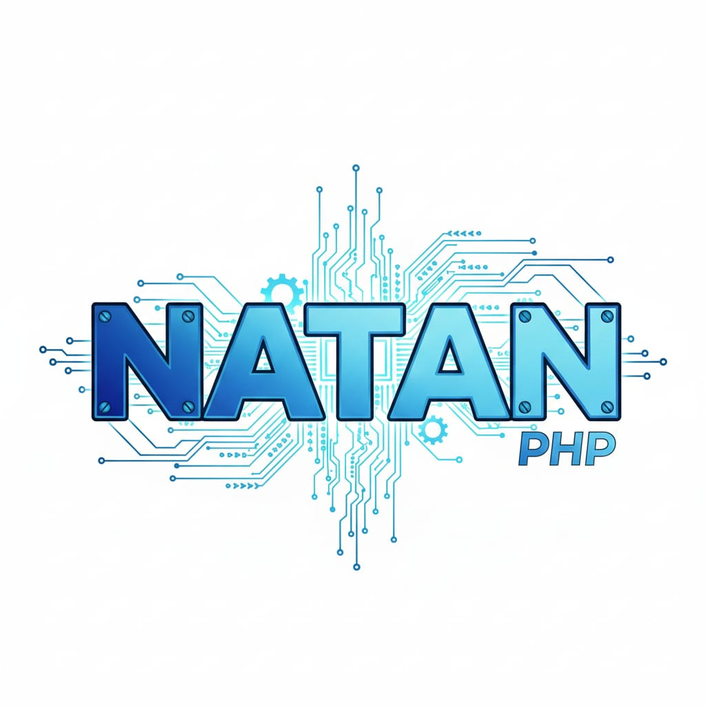

<div align="center">
  
  
  # NatanPHP Framework
  
  *Framework PHP MVC Simple, Moderno e Innovador*
  
  [](https://php.net)
  [](LICENSE)
  [](https://github.com/jhonatanfdez/natan-php)
  
  **Un framework PHP diseñado para enseñar y aprender cómo funcionan los frameworks modernos por dentro**
  
  📍 **Estado actual: v0.2.1** — Documentación completa con 7 páginas (~5,680 líneas, 150+ ejemplos), GitHub Pages live, 140 tests con cobertura 100%, documentación exhaustiva en español.
  
  • **Changelog**: ver [v0.2.1 en CHANGELOG.md](CHANGELOG.md#v021---2024-12-14) · **Tag**: [v0.2.1](https://github.com/jhonatanfdez/natan-php/releases/tag/v0.2.1)
  
  ---
  
  ## 📚 Documentación Completa
  
  **[📖 Ver Documentación en Vivo →](https://jhonatanfdez.github.io/natan-php/)**
  
  Documentación completa en español con 7 páginas, ~5,680 líneas, 150+ ejemplos de código:
  - 🚀 [Instalación](https://jhonatanfdez.github.io/natan-php/#/installation)
  - 🚪 [Routing](https://jhonatanfdez.github.io/natan-php/#/basics/routing) - Sistema de rutas (~850 líneas)
  - 📨 [Request](https://jhonatanfdez.github.io/natan-php/#/basics/requests) - Manejo de peticiones (~1,180 líneas)
  - 🛠️ [Helpers](https://jhonatanfdez.github.io/natan-php/#/digging-deeper/helpers) - 10 funciones auxiliares (~1,450 líneas)
  - ⚙️ [Configuration](https://jhonatanfdez.github.io/natan-php/#/configuration) - Variables de entorno (~670 líneas)
  - 📁 [Directory Structure](https://jhonatanfdez.github.io/natan-php/#/directory-structure) - Estructura de carpetas (~980 líneas)
</div>

---

## 📰 **Novedades Recientes**

- **v0.2.0**: 🎉 **Suite Completa de Testing** - 140 tests totales (320+ assertions) con cobertura 100% del framework core en 4 fases: Helpers (54 tests), Request (34 tests), Router (29 tests), Integration (15 tests). Todos los tests con comentarios en español, casos edge documentados (blank(0) vs blank('0'), prioridad input(), grupos anidados), PHPUnit 10.5.58, documentación exhaustiva en comandos_ejecutados.txt y claude.md.
- **v0.1.9**: 🧹 **Repository Optimizado** - Limpieza completa siguiendo mejores prácticas PHP, vendor/ excluido del tracking (95 archivos menos), configuración inteligente de .gitignore para testing, phpunit.xml trackeable con variants ignorados, setup colaborativo profesional.
- **v0.1.8**: 🧪 **Sistema de Testing Completo** - Framework de pruebas automatizadas con PHPUnit 10.5.58, tests unitarios fundamentales (8 tests, 13 assertions), estructura incremental con FirstTest.php y HelpersTest.php, scripts de testing en composer, bootstrap minimalista, documentación completa de comandos de testing.
- **v0.1.6**: 🖥️ **CLI Multiplataforma** - Compatibilidad completa Windows/macOS/Linux con auto-detección de SO, comandos nativos para cada plataforma (netstat/taskkill en Windows, lsof/kill en Unix), UX mejorado sin confusión técnica, mensajes claros con URLs útiles en lugar de 0.0.0.0.
- **v0.1.5**: 🛠️ **CLI Robusto** - Comando `natan serve` con gestión inteligente de puertos (auto-detección con lsof/fuser/netstat), terminación automática de procesos ocupados, liberación inteligente de puertos, manejo automático de directorios, compatibilidad PHP 8.2+ (fix warnings trim), CLI completamente automático y profesional.
- **v0.1.4**: 🌐 **Sistema de URLs Dinámicas + CLI** - URLs completamente adaptables automáticamente a cualquier entorno (DDEV/PHP built-in/Apache), comando `natan serve` funcional, detección mejorada de controladores Web vs API, eliminación de URLs hardcodeadas, configuración zero-configuration.
- **v0.1.3**: 🛣️ **Router.php implementado** - Sistema completo de rutas dinámico con métodos HTTP (GET/POST/PUT/DELETE/PATCH), parámetros dinámicos {id}/{slug}, grupos con prefijos/middleware, resolución automática Web vs API, inyección de parámetros, patrón Fluent Interface, gestión centralizada de versiones.
- **v0.1.2**: 🌐 **Request.php implementado** - Clase completa para manejo de peticiones HTTP con 20+ métodos, soporte para GET/POST/archivos/headers, detección de AJAX/JSON, integración con helpers del framework.
- **v0.1.1**: 🔧 **Optimización de helpers** - Simplificación de 20+ funciones a 8 esenciales con documentación detallada, estrategia incremental establecida, y sincronización completa de documentación con código real.
- **v0.1.0**: 🎉 **Framework base establecido** - Estructura de carpetas Web/API implementada, autoloading PSR-4 configurado, sistema de helpers esenciales con 8 funciones básicas (dd(), env(), config(), asset(), url(), str_slug(), blank(), filled()), comando CLI `natan` preparado.

## ⚡ **Funcionalidades Actuales (v0.2.0)**

### 🧪 **Suite Completa de Testing (PHPUnit)** ✅ **NUEVO v0.2.0**

- **140 Tests Totales** ✅ 320+ assertions, 100% cobertura framework core
  - HelpersAdvancedTest.php: 21 tests (dd, dump, env, config, route, redirect, old, csrf, abort)
  - HelpersExpandedTest.php: 33 tests (blank, filled, value, class_basename, e, str helpers, array_get)
  - RequestTest.php: 34 tests (construcción, métodos HTTP, headers, input, query, cookies, path/URL, utilidades)
  - RouterTest.php: 29 tests (rutas básicas, params dinámicos, middleware, grupos, resources, API resources)
  - FrameworkIntegrationTest.php: 15 tests (Request+Router, Helpers+Request, Router+Middleware, escenarios complejos, API REST, formularios)
  
- **Calidad y Documentación** ✅ Completo
  - Todos los tests con comentarios explicativos en español
  - Casos edge documentados: blank(0) vs blank('0'), prioridad input() POST>GET, acumulación grupos
  - Assertions descriptivas con mensajes claros
  - Tiempo de ejecución: < 1 segundo
  - PHPUnit 10.5.58 vía Composer

- **Comandos de Testing**
  ```bash
  ./vendor/bin/phpunit                    # Ejecutar todos los tests
  ./vendor/bin/phpunit --testdox          # Output descriptivo
  composer test                           # Alias configurado
  ```

### �️ **CLI Multiplataforma** ✅ **v0.1.6**
- **Compatibilidad Completa Windows/macOS/Linux** ✅ Completo
  - Auto-detección de sistema operativo con `PHP_OS`
  - Comandos nativos Windows: `netstat -ano | findstr :puerto` y `taskkill /PID /F`
  - Comandos Unix/Linux/macOS: `lsof -ti:puerto`, `fuser -n tcp`, `kill -9`
  - Zero-configuration: funciona automáticamente en cualquier SO

- **UX Mejorado Sin Confusión Técnica** ✅ Completo
  - URLs claras y útiles en lugar de `0.0.0.0` confuso
  - Recomendaciones específicas para entorno DDEV vs normal
  - Información de compatibilidad en comando `help`
  - Mensajes técnicos separados de información útil para usuario
- **Comando `natan serve` Completamente Automático** ✅ Completo
  - Auto-detección de puertos ocupados con múltiples métodos (lsof, fuser, netstat)
  - Terminación automática de procesos que usan puertos
  - Liberación inteligente de puertos antes de iniciar servidor
  - Manejo automático de directorios (cambio a public/)
  - Compatibilidad cross-platform con múltiples sistemas operativos

- **Gestión Robusta de Procesos** ✅ Completo
  - Función `checkAndFreePort()` con múltiples métodos de detección
  - Mejor feedback al usuario sobre estado de puertos
  - Manejo de errores con múltiples fallbacks
  - Espera inteligente para liberación de puertos
  - Professional UX con información detallada

### 🔧 **Compatibilidad PHP 8.2+** ✅ **v0.1.5**
- **Fix de Warnings PHP 8.2** ✅ Completo
  - Eliminados warnings "trim(): Passing null deprecated"
  - Manejo seguro de valores null en operaciones de string
  - Código compatible con versiones modernas de PHP
  - Zero-friction development experience

### 🌐 **Sistema de URLs Dinámicas** ✅ **ESTABLE**
- **Detección Automática de Entorno** ✅ Completo
  - Auto-detección de protocolo (HTTP/HTTPS) desde `$_SERVER['HTTPS']`
  - Detección automática de host y puerto del servidor actual
  - Compatibilidad total con DDEV, PHP built-in server, Apache, etc.
  - URLs que se adaptan automáticamente sin configuración manual

- **Helpers URL Inteligentes** ✅ Completo
  - `url($path)` - URLs dinámicas que funcionan en cualquier entorno
  - `asset($path)` - Recursos estáticos con URLs automáticas
  - `route($name, $params)` - Base para named routes (preparado)
  - Zero-configuration: funciona desde el primer momento

### 🚀 **Comando CLI `natan`** ✅ **NUEVO**  
- **Servidor de Desarrollo** ✅ Funcional
  - `php natan serve` - Inicia servidor con configuración del .env
  - `php natan serve localhost 3000` - Host y puerto personalizados
  - Configuración automática desde `APP_URL` en .env
  - URLs dinámicas en ayuda según configuración actual

- **Utilidades de Framework** ✅ Funcional
  - `php natan version` - Versión del framework y PHP
  - `php natan help` - Ayuda completa con ejemplos
  - Archivo ejecutable (`chmod +x natan`)
  - Documentación integrada

### 🏗️ **Infraestructura Base**
- **Autoloading PSR-4** ✅ Completo
  - Namespaces `Core\` y `App\` configurados
  - Carga automática de helpers globales
  - Integración con Composer

- **Estructura Innovadora Web/API** ✅ Completo
  - Separación clara: `app/Web/`, `app/Api/`, `app/Shared/`
  - Organización por función, no por tipo de archivo
  - Escalabilidad desde proyectos pequeños hasta complejos

### 🛠️ **Sistema de Helpers (8 funciones esenciales)**
- **Debugging** ✅ Funcional
  - `dd(...$vars)` - Debug elegante con var_dump y terminación de script
  
- **Configuración** ✅ Funcional
  - `env($key, $default)` - Variables de entorno con conversión de tipos
  - `config($key, $default)` - Configuración de aplicación con notación punto
  
- **URLs y Assets** ✅ Funcional
  - `url($path)` - URLs absolutas de la aplicación
  - `asset($path)` - URLs de recursos estáticos (CSS, JS, imágenes)
  
- **Utilidades de String** ✅ Funcional
  - `str_slug($string, $separator)` - Conversión a slug amigable para URLs
  
- **Utilidades de Validación** ✅ Funcional
  - `blank($value)` - Verificar si está vacío (null, '', arrays vacíos, espacios)
  - `filled($value)` - Verificar si tiene contenido (opuesto de blank)

- **Información del Framework** ✅ Funcional
  - `version()` - Obtener la versión actual del framework

**📝 Nota**: Funciones adicionales se agregarán incrementalmente según necesidades del desarrollo.

### 🌐 **Sistema de Peticiones HTTP (Request.php)**
- **Manejo Completo de Peticiones** ✅ Funcional
  - `method()`, `isGet()`, `isPost()` - Detección de métodos HTTP
  - `uri()`, `fullUrl()` - Acceso a URLs con y sin query strings
  - `get()`, `post()`, `input()` - Acceso seguro a datos de entrada
  - `all()`, `only()`, `except()` - Filtrado flexible de datos
  
- **Funcionalidades Avanzadas** ✅ Funcional
  - `has()`, `filled()` - Validación de existencia y contenido
  - `file()`, `hasFile()` - Manejo de archivos subidos
  - `header()`, `ip()`, `userAgent()` - Información de petición
  - `isAjax()`, `wantsJson()` - Detección para APIs modernas

**🔗 Integración**: Usa helpers del framework y prepara base para Router y Controladores.

### 🛣️ **Sistema de Rutas (Router.php)**
- **Registro de Rutas** ✅ Funcional
  - `Router::get()`, `Router::post()`, `Router::put()`, `Router::delete()` - Métodos HTTP
  - `Router::match()`, `Router::any()` - Múltiples métodos para una ruta
  - Parámetros dinámicos: `/usuario/{id}`, `/posts/{slug}/comentarios`
  
- **Grupos y Organización** ✅ Funcional
  - `Router::group()` - Agrupación con prefijos y middleware compartido
  - Resolución automática Web vs API controllers
  - Inyección automática de parámetros en métodos
  
- **Funcionalidades Avanzadas** ✅ Funcional
  - Patrón Fluent Interface: `->middleware()->name()`
  - RouteRegistrar para configuración encadenada
  - Manejo robusto de errores 404 con excepciones descriptivas
  - Extracción inteligente de parámetros con expresiones regulares

**🔗 Integración**: Usa Request.php para análisis de peticiones y prepara base para Controladores.

### 📁 **Gestión de Proyecto**
- **Entorno de Desarrollo** ✅ DDEV configurado
  - Base de datos MySQL lista
  - PHP 8.0+ configurado
  - Variables de entorno (.env.example)
  
- **Control de Versiones** ✅ Git inicializado
  - Repositorio configurado
  - .gitignore optimizado para PHP
  - Commits en español con convención

### ⚙️ **Comando CLI `natan`**
- **Base preparada** ✅ Script ejecutable
  - Comando `php natan` listo para extensión
  - Estructura para comandos de generación
  - Sistema de ayuda implementable

### 🔜 **Próximo en Desarrollo**

**✅ COMPLETADO v0.1.4**: Sistema de URLs Dinámicas y CLI
- ✅ URLs adaptables automáticamente a cualquier entorno
- ✅ Comando `natan serve` funcional con configuración .env  
- ✅ Detección mejorada de controladores Web vs API
- ✅ Fix crítico: `/api` usa controlador API correctamente

**PASO 10: Implementar Sistema de Vistas/Templates**
- Motor de plantillas simple e intuitivo
- Herencia de plantillas (layouts)
- Componentes reutilizables
- Integración con controladores existentes

**PASO 11: Sistema de Base de Datos**
- Query Builder básico pero potente
- Migraciones simples
- Seeding de datos de prueba
- Integración con helpers existentes

---

## 🚀 **¿Qué es NatanPHP?**

NatanPHP es un framework PHP MVC completo diseñado con fines **educativos** pero totalmente **funcional**. A diferencia de Laravel que puede ser complejo para principiantes, NatanPHP tiene una arquitectura **simple, clara e innovadora** que permite entender fácilmente cómo funcionan los frameworks modernos por dentro.

## 🎯 **Filosofía: "Simplicidad con Propósito"**

### ✨ Diferencias clave con Laravel:

| Laravel | NatanPHP |
|---------|----------|
| `app/Http/Controllers/` | `app/Web/Controllers/` y `app/Api/Controllers/` |
| `php artisan` | `php natan` |
| Core complejo en vendor | Core educativo en `core/` |
| Todo mezclado | Separación clara Web/API |

## 🏗️ **Estructura Innovadora**

```
natan-php/
├── 🧠 core/                    # El cerebro del framework
│   ├── Router.php              # Sistema de rutas
│   ├── Database.php            # Conexión y ORM
│   ├── View.php                # Motor de plantillas
│   └── Console.php             # Sistema de comandos
├── 🏠 app/                     # Tu aplicación
│   ├── Web/                    # TODO lo relacionado con WEB
│   │   ├── Controllers/        # Controladores web
│   │   └── Views/              # Vistas y plantillas
│   ├── Api/                    # TODO lo relacionado con API
│   │   ├── Controllers/        # Controladores API
│   │   └── Resources/          # Transformadores JSON
│   ├── Shared/                 # Compartido entre Web y API
│   │   ├── Models/             # Modelos de datos
│   │   ├── Services/           # Lógica de negocio
│   │   └── Middleware/         # Middleware compartido
│   └── Database/               # Base de datos
│       ├── migrations/         # Migraciones
│       └── seeds/              # Datos de prueba
├── 📁 public/                  # Punto de entrada
├── 🛣️ routes/                  # Rutas separadas
│   ├── web.php                 # Rutas web
│   └── api.php                 # Rutas API
├── ⚙️ config/                  # Configuración
└── natan                       # Comando CLI
```

## 🛠️ **Características Principales**

### 🎨 **Motor de Plantillas Personalizado**
```php
@extends('layouts.app')

@section('content')
<h1>{{ $title }}</h1>
@foreach($products as $product)
    <div>{{ $product->name }} - ${{ $product->price }}</div>
@endforeach
@endsection
```

### 🗄️ **ORM Potente y Simple**
```php
// Consultas intuitivas
$users = User::where('active', 1)->get();
$user = User::find(1);

// Relaciones fluidas
$posts = $user->posts()->paginate(10);

// Creación fácil
User::create(['name' => 'Juan', 'email' => 'juan@example.com']);
```

### 🚀 **Separación Clara Web/API**
```php
// Controlador Web
app/Web/Controllers/ProductController.php
→ return $this->view('products.index', $data);

// Controlador API  
app/Api/Controllers/ProductController.php
→ return $this->jsonResponse($data);
```

### ⚡ **Comando CLI Intuitivo "natan"**
```bash
# Crear CRUD completo para WEB
php natan create crud Product --web

# Crear CRUD completo para API
php natan create crud Product --api

# Crear CRUD completo (Web + API)
php natan create crud Product --full

# Agregar campos interactivamente
php natan field add Product

# Ver estructura de tabla
php natan table describe Product
```

## 🚀 **Roadmap de Desarrollo**

### ✅ **v0.1.0 - Estructura Base (Completado)**
- **Infraestructura** ✅ Estructura de carpetas Web/API implementada
- **Autoloading** ✅ PSR-4 configurado y funcionando
- **Helpers** ✅ 20+ funciones esenciales implementadas
- **Entorno** ✅ DDEV, Composer, dependencias instaladas
- **CLI** ✅ Comando `natan` base preparado

### 🔄 **v0.2.0 - Core Classes (En Desarrollo)**
- **Core/Request.php** ✅ **COMPLETADO** - Manejo de peticiones HTTP (20+ métodos)
- **Core/Router.php** ✅ **COMPLETADO** - Sistema de rutas dinámico (v0.1.3)
- **Controladores Ejemplo** 🔄 **PRÓXIMO** - HomeController y UsuariosController 
- **Core/View.php** ⏳ Pendiente - Motor de plantillas tipo Blade
- **Core/Database.php** ⏳ Pendiente - ORM y Query Builder

### ✅ **v0.1.3 - Router Implementado (Completado)**
- **Core/Router.php** ✅ Sistema completo de rutas dinámico
  - Métodos HTTP: GET, POST, PUT, DELETE, PATCH, MATCH, ANY
  - Parámetros dinámicos: `/usuario/{id}`, `/posts/{slug}`
  - Grupos de rutas con prefijos y middleware
  - Resolución automática Web vs API controllers
  - Inyección automática de parámetros
  - Patrón Fluent Interface y RouteRegistrar
- **Gestión de Versiones** ✅ Centralizada con función `version()`

### 📋 **v0.3.0 - Sistema CLI (Planificado)**
- **Generadores de Código** ⏳ CRUDs automáticos
- **Comandos de BD** ⏳ Migraciones y seeds
- **Utilidades** ⏳ Optimización y limpieza

### 🎯 **v1.0.0 - Framework Completo (Meta)**
- **Todas las características** ⏳ Framework funcional completo
- **Documentación** ⏳ Guías y ejemplos completos
- **Testing** ⏳ Suite de pruebas automatizadas

### 📋 **Funciones Helpers Implementadas (v0.1.3)**
```php
// Debugging ✅ FUNCIONANDO
dd($usuario, $productos);               // Debug elegante con var_dump y exit

// Configuración ✅ FUNCIONANDO
env('APP_NAME', 'NatanPHP');           // Variables de entorno con conversión de tipos
config('app.name', 'Framework');       // Configuración con notación punto

// URLs y Assets ✅ FUNCIONANDO
url('/productos');                      // URLs absolutas: http://localhost:8000/productos
asset('css/app.css');                   // Assets: http://localhost:8000/assets/css/app.css

// Utilidades de String ✅ FUNCIONANDO
str_slug('Mi Título Genial');           // Resultado: "mi-titulo-genial"

// Utilidades de Validación ✅ FUNCIONANDO
blank($value);                          // true si es null, '', array vacío, espacios
filled($value);                         // true si tiene contenido (opuesto de blank)
```

**💡 Estrategia Incremental**: Las funciones se van agregando según necesidades reales del desarrollo.

## 🚀 **Inicio Rápido**

### 1. **Instalación**
```bash
# Clonar el repositorio
git clone https://github.com/jhonatanfdez/natan-php.git
cd natan-php

# Cambiar al directorio docroot (donde está el framework)
cd docroot

# Instalar dependencias con Composer
composer install

# Configurar archivo de entorno
cp .env.example .env

# Hacer ejecutable el comando CLI (macOS/Linux)
chmod +x natan

# Verificar instalación
php natan version
```

### 2. **Iniciar servidor de desarrollo**
```bash
# Iniciar servidor en puerto por defecto (8080)
php natan serve

# O especificar host y puerto
php natan serve localhost 3000

# Visitar la aplicación
# Local: http://localhost:8080
# DDEV: https://natanphp-framework.ddev.site
```

### 2. **Configurar Base de Datos**
```bash
# Editar .env con tus datos de BD
DB_HOST=localhost
DB_NAME=mi_base_datos
DB_USER=usuario
DB_PASS=contraseña

# Ejecutar migraciones
php natan migrate
```

### 4. **Ejecutar tests (verificar instalación)**
```bash
# Ejecutar todos los tests unitarios
./vendor/bin/phpunit tests/Unit/

# Ver detalles descriptivos de cada test
./vendor/bin/phpunit tests/Unit/ --testdox

# Usar scripts de composer 
composer test

# Resultado esperado: ✅ OK (8 tests, 13 assertions)
```

### 5. **Crear tu primer módulo**
```bash
# CRUD completo para web
php natan create crud Product --web

# O para API
php natan create crud Product --api

# O ambos
php natan create crud Product --full
```

### 4. **Iniciar servidor**
```bash
php natan serve
# Visita: http://localhost:8000
```

## 📚 **Ejemplos de Código**

### **Modelo con Relaciones**
```php
// app/Shared/Models/Product.php
class Product extends Model 
{
    protected $fillable = ['name', 'price', 'description'];
    
    public function category() 
    {
        return $this->belongsTo(Category::class);
    }
    
    public function reviews() 
    {
        return $this->hasMany(Review::class);
    }
}
```

### **Controlador Web**
```php
// app/Web/Controllers/ProductController.php
class ProductController extends Controller 
{
    public function index() 
    {
        $products = Product::with('category')->paginate(10);
        return $this->view('products.index', compact('products'));
    }
    
    public function store() 
    {
        $product = Product::create(request()->all());
        return redirect('/products');
    }
}
```

### **Controlador API**
```php
// app/Api/Controllers/ProductController.php
class ProductController extends ApiController 
{
    public function index() 
    {
        $products = Product::with('category')->paginate(10);
        return $this->successResponse($products);
    }
    
    public function store() 
    {
        $product = Product::create(request()->json());
        return $this->successResponse($product, 'Producto creado');
    }
}
```

### **Vista Web**
```php
<!-- app/Web/Views/products/index.natan.php -->
@extends('layouts.app')

@section('title', 'Lista de Productos')

@section('content')
<div class="container">
    <h1>Nuestros Productos</h1>
    
    <div class="row">
        @foreach($products->items() as $product)
        <div class="col-md-4">
            <div class="card">
                <div class="card-body">
                    <h5>{{ $product->name }}</h5>
                    <p>{{ $product->description }}</p>
                    <span class="price">${{ $product->price }}</span>
                </div>
            </div>
        </div>
        @endforeach
    </div>
    
    {{ $products->links() }}
</div>
@endsection
```

## 🎓 **Propósito Educativo**

NatanPHP está diseñado para enseñar:

- **🏗️ Arquitectura MVC**: Cómo separar correctamente responsabilidades
- **🔄 Patrones de Diseño**: Active Record, Factory, Observer
- **📦 Autoloading PSR-4**: Cómo funcionan los namespaces
- **🗄️ ORM**: Construcción de Query Builders y relaciones
- **🎨 Motor de Plantillas**: Compilación y cache de vistas
- **⚡ CLI**: Creación de comandos de consola
- **🚀 APIs REST**: Separación y diseño de endpoints
- **📊 Paginación**: Implementación propia sin librerías

## 🛠️ **Comandos Disponibles**

### **Creación**
```bash
php natan create controller UserController --web
php natan create controller UserController --api
php natan create model User
php natan create crud Product --full
```

### **Base de Datos**
```bash
php natan field add User          # Agregar campos interactivo
php natan field modify User email # Modificar campo
php natan table describe User     # Ver estructura
php natan migrate                 # Ejecutar migraciones
```

### **Proyecto**
```bash
php natan project mode web   # Solo funcionalidad web
php natan project mode api   # Solo funcionalidad API
php natan project mode full  # Funcionalidad completa
```

### **Utilidades**
```bash
php natan routes list        # Listar rutas
php natan serve             # Servidor desarrollo
php natan project optimize  # Limpiar archivos no usados
```

## 🔧 **Configuración**

### **Modos de Proyecto**

**Web Only** - Para aplicaciones tradicionales:
```bash
php natan project mode web
# Elimina: app/Api/, routes/api.php
# Optimiza: Solo funcionalidad web
```

**API Only** - Para APIs REST:
```bash
php natan project mode api  
# Elimina: app/Web/, vistas
# Optimiza: Solo endpoints JSON
```

**Full** - Funcionalidad completa:
```bash
php natan project mode full
# Mantiene: Web + API
# Funcionalidad: Completa
```

## 🌟 **¿Por qué NatanPHP?**

### ✅ **Para Estudiantes:**
- **Core visible**: Puedes leer y entender el código del framework
- **Estructura clara**: No te pierdes en carpetas complicadas
- **Progresión**: Empieza simple, crece según necesidades
- **Documentado**: Cada archivo explica qué hace y por qué

### ✅ **Para Desarrolladores:**
- **Productivo**: CRUD completo en un comando
- **Flexible**: Separa web y API claramente
- **Moderno**: Sintaxis familiar a Laravel
- **Ligero**: Sin complejidad innecesaria

### ✅ **Para Proyectos:**
- **Escalable**: Crece con tu aplicación
- **Mantenible**: Código limpio y organizado
- **Rápido**: Sin overhead de frameworks pesados
- **Educativo**: Tu equipo aprende mientras desarrolla

## 📖 **Documentación**

- [📋 Guía de Inicio](docs/getting-started.md)
- [🏗️ Arquitectura](docs/architecture.md)
- [⚡ Comandos CLI](docs/commands.md)
- [🗄️ ORM y Base de Datos](docs/database.md)
- [🎨 Motor de Plantillas](docs/templating.md)
- [🚀 API REST](docs/api.md)

## 🤝 **Contribuir**

¡Las contribuciones son bienvenidas! Este es un proyecto educativo y cualquier mejora ayuda a la comunidad.

1. Fork el proyecto
2. Crea tu rama de feature (`git checkout -b feature/AmazingFeature`)
3. Commit tus cambios (`git commit -m 'Add some AmazingFeature'`)
4. Push a la rama (`git push origin feature/AmazingFeature`)
5. Abre un Pull Request

## 📄 **Licencia**

Este proyecto está bajo la Licencia MIT. Ver el archivo [LICENSE](LICENSE) para más detalles.

## 👨‍💻 **Autor**

**Jhonatan Fernández** - [@jhonatanfdez](https://github.com/jhonatanfdez)

---

<div align="center">
  
  
  **⭐ Si te gusta NatanPHP, ¡dale una estrella! ⭐**
  
  *Hecho con ❤️ para la comunidad educativa*
  
</div>
